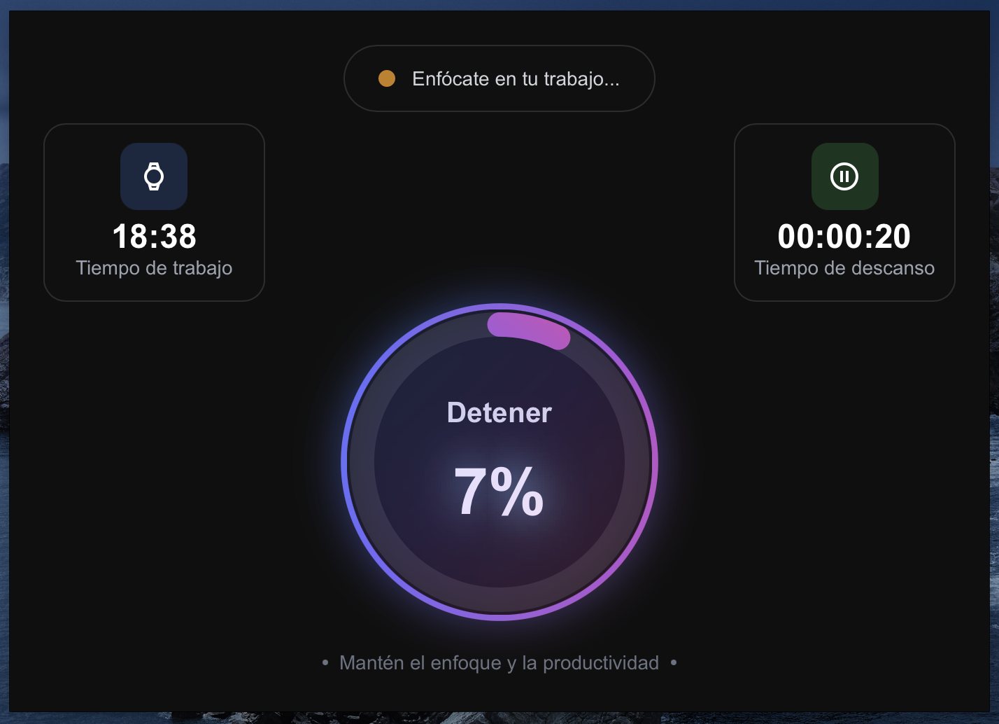

<div align="center">

  
  <h1>EyesBreak</h1>

  <h3>Your Visual Health Companion</h3>
  
  [](https://opensource.org/licenses/MIT)
  [](https://angular.io/)
  [](https://tauri.app/)
  [](https://bun.sh/)
  [](https://www.rust-lang.org/)
  [](https://www.rust-lang.org/)

  <p align="center">
    
  </p>
</div>

---

EyesBreak is a desktop application designed to help users maintain healthy visual rest routines. The app periodically reminds you when it's time to take a break, offering guided eye exercises and recommendations to reduce eye strain.

## 🚀 Features

- Scheduled reminders for visual breaks
- Guided eye exercises
- Customizable work and break intervals
- Intuitive and user-friendly interface
- Available for Windows, macOS, and Linux

## 📦 System Requirements

- Node.js 19.0.1 or higher
- Angular CLI 19.0.1
- Rust 1.87.0 or higher
- Cargo 1.87.0
- Tauri (will be installed automatically)

## 🛠️ Development Setup

### 1. Clone the Repository

```bash
git clone https://github.com/tuusuario/eyes-break.git
cd eyes-break
```

### 2. Install Dependencies

```bash
# Install Node.js dependencies
bun install

# Install Rust (if not already installed)
curl --proto '=https' --tlsv1.2 -sSf https://sh.rustup.rs | sh

# Install system dependencies for Tauri
# For macOS:
brew install create-dmg
# For Ubuntu/Debian:
# sudo apt install libwebkit2gtk-4.0-dev build-essential curl wget libssl-dev libgtk-3-dev libayatana-appindicator3-dev librsvg2-dev
```

## 🚀 Start Development Server

```bash
# Run the Angular development server
bun tauri dev
```

## 🏗️ Build for Production

```bash
# Build the executable with Tauri
bun tauri build
```

## 🧹 Maintenance and Cleanup

To ensure optimal performance and free up disk space, we provide a cleanup script that removes build artifacts and cached dependencies. This is particularly useful when you need to:

- Free up disk space (can save several hundred MB to a few GB)
- Resolve dependency-related issues
- Ensure a clean build environment
- Prepare for a fresh installation

### Running the Cleanup Script

```bash
# Make the script executable (only needed once)
chmod +x cleanup.sh
```

```bash
# Execute the cleanup script
./cleanup.sh
```

This script will:
1. Remove the `node_modules/` directory (saves ~200-500MB)
2. Remove the `dist/` directory (saves ~50-200MB)
3. Run `cargo clean` in the `src-tauri` directory (saves ~300MB-2GB)

> **Note**: After running the cleanup, you'll need to reinstall dependencies with `bun install` before the next development session.

### What Gets Cleaned

| Directory/Command | What it Removes | Approx. Space Saved |
|-------------------|----------------|---------------------|
| `node_modules/`   | Node.js dependencies | 200-500MB |
| `dist/`          | Build output files | 50-200MB |
| `cargo clean`     | Rust build artifacts | 300MB-2GB |

## 📚 Developer Documentation

### Project Structure

```
src/
├── app/               # Angular modules and components
├── public/            # Static assets
├── styles/            # Global styles
└── tauri/             # Tauri configuration
```

### Code Conventions

- Use TypeScript with strict typing
- Follow Angular style guide

### Basic Usage

1. On startup, the app will minimize to the system tray
2. The app will notify you when it's time to take a break
3. Follow the on-screen exercises during the break
4. The app will automatically resume after the break

### Customization

You can customize the application from the settings menu:

- Work interval (default: 20 minutes)
- Break duration (default: 20 seconds)
- Enable/disable notifications
- Start with the system

## 📄 License

This project is licensed under the MIT License - see the [LICENSE](LICENSE) file for more details.

## 📞 Support

If you encounter any issues or have questions, please [open an issue](https://github.com/tuusuario/eyes-break/issues).

## 🌐 Useful Links

- [Angular Documentation](https://angular.io/docs)
- [Tauri Documentation](https://tauri.app/)
- [Angular Style Guide](https://angular.io/guide/styleguide)

## 🤝 Contributing

Contributions are welcome! Please read our [contribution guide](CONTRIBUTING.md) to get started.

## 🙏 Acknowledgments

- [Tauri](https://tauri.app/) - For the desktop application framework
- [Angular](https://angular.io/) - For the frontend framework
- [Bun](https://bun.sh/) - For package management and script running
